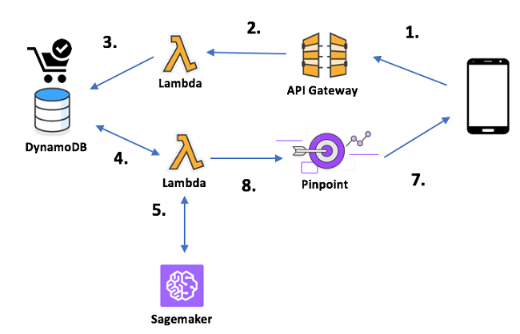

# IoT System

## AWS IoT


인터넷에 연결된 디바이스가 AWS 클라우드에 연결할 수 있고, 클라우드 상의 App이 해당 디바이스와 상호작용할 수 있게 하는 서비스.  
\(IoT App: 디바이스에서 원격 측정을 수집 및 처리하거나 사용자가 원격으로 디바이스를 제어할 수 있게 제공\)


#### Device Gateway

* MQTT 및 HTTP를 이용한 Things와의 커뮤니케이션
* Lightweight, N : N pub/sub
* Secure TCP/IP port 8883
* X.509 인증서 및 TLS 1.2 상호 인

> **MQTT vs HTTPS**  
>   • 93x faster throughput   
>   • 11.89x less battery to send   
>   • 170.9x less battery to receive   
>   • 50% less power to keep connected   
>   • 8x less network overhead

#### Authentication / Authorization

* 상호 인증 및 암호화로 보안강화
* TLS 기반 상호 인

#### Registry

* Things 등록 및 관리
* AWS IoT 에 연결된 모든 디바이스는 Registry에 등록
* 사물과 관련된 static 속성 저장 \(펌웨어 버전, 시리얼 번호, 다비으스 유형/그룹/설명, 센서 설명\)
* 지원 및 유지보수를 위한 추가 속성 \(설명서 URL, 부품 번호 등\)

#### Rule Engine

* 특정 rule을 기반으로 메시지를 필터링 하고 메시지를 변환
* SQL 기반으로 topic 필터 정

* `Lambda` : function 호출
* `S3` : bucket에 객체 저장
* `DynamoDB` : 테이블에 insert, update
* `SNS` : topic 또는 endpoint에 publish
* `Kinesis` : stream에 publish
* `Firehose` : publish
* `AWS IoT` : Republish
* `CloudWatch` : metric 생성 또는 알람 변경
* `Elasticsearch` : publish
* `SQS` : queue에 쓰

#### Device Shadow

* IoT에 연결된 각 디바이스의 상태 영구 저장
* Device Shadow를 통해 디바이스와 App이 통신

## Kinesis Video Stream

## SageMaker 


AWS에서 학습 모델을 구축 및 교육하고 Production 환경에 Deploy 할 수 있는 플랫


#### Serverless Deploy

사전에 training 된 모델을 public Docker 이미지에서 Amazon SageMaker로 배포

## Model Serving Architecture

## Link



